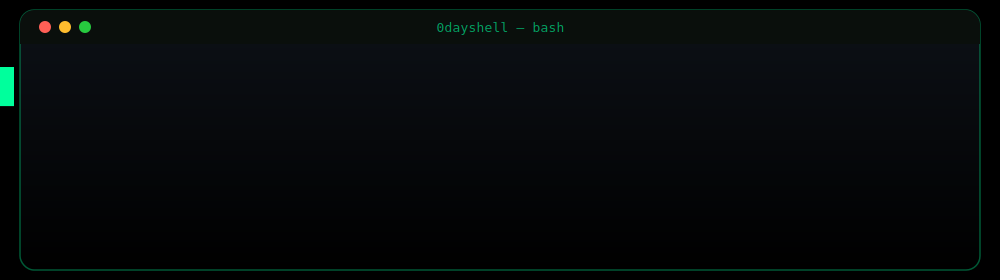

<div align="center">



<a href="https://github.com/0dayshell">
  
</a>

<br/>



<br/>

</div>

<br/>

## `0x00` whoami

```yaml
name: Navaneeth GP
role: Security Researcher
focus: [ Web App Security, API Security, OSINT ]
currently_learning: [ Mobile Pentesting, Cloud Security, Web3 ]
fun_fact: "I break things professionally so you don't have to worry about it personally."
```

I'm **NAVANEETH**, a hacker and security researcher focused on offensive security, vulnerability research, and building tools that make the internet a little less broken. I spend my time hunting bugs and writing about what I find.

<details>
<summary><b>▸ more about me</b></summary>
<br/>

- 🔭 Currently working on: `******* *****`
- 🌱 Currently learning: mobile pentesting, cloud security, Web3 security
- 💬 Ask me about: web app security, OSINT, malware analysis
- 📫 Reach me: `navaneethprabhu2001@gmail.com`
- ⚡ Fun fact: `[Im still a P1 virgin! shhhh!🤫]`

</details>

<br/>

## `0x01` current status

```diff
+ Hunting bugs & writing exploits
+ Active in small infosec community
! Currently learning: mobile pentesting & Web3 security
# Status: caffeinated, online, probably in a terminal
```

<br/>

## `0x02` arsenal

<div align="center">

**Offensive Security**


**Weapons**


**Languages**


**Systems**


<br/>

<br/>

## `0x04` root access

<div align="center">


<br/>

```bash
$ sudo rm -rf /excuses
$ echo "no system is 100% secure, but I'll find out why"
```

</div>

<br/>


## `0x06` connect

<div align="center">

<a href="https://www.linkedin.com/in/navaneethgprabhu"></a>
<a href="https://x.com/404_errorfound_"></a>
<a href="mailto:navaneethprabhu2001@gmail.com"></a>
<a href="https://medium.com/@navaneethprabhu"></a>

</div>


